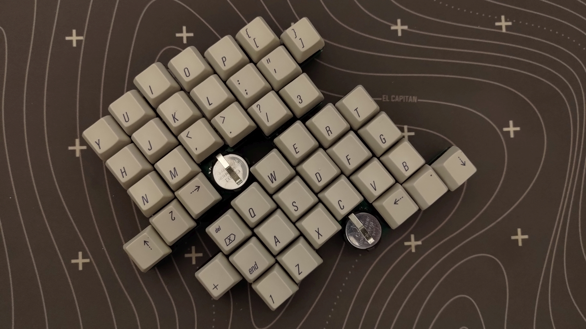

# Jorian 840

44-key wireless split keyboard in a 100x100 mm PCB.

Two main versions are available with plenty of supported switches.

Plates and bottoms are to be cut from metal, acryllic or dual-layered plastic.

## Disclaimer

This is a modified version of Joric's Jorian.

The keyboard layout was derived from the [Jian layout](http://www.keyboard-layout-editor.com/#/gists/4b6c2af67148f58ddd6c6b2976c4370f) (just visually, there was no actual copying involved).
Please buy the Jian from its author, [/u/KgOfHedgehogs](http://reddit.com/u/KgOfHedgehogs) at [the official store](https://killswit.ch)

## Features

* Wireless via Holyiot 18010 modules
* Fully-featured ZMK split
* Uses either 233350 310 mAh, LIR2032 40 mAh or CR2032 220 mAh (non-rechargeable) batteries
* Charger on/off switch (for non-rechargeable batteries)
* Proper case support
* Adjustable pinky stagger in the solder version
* Can be built with 7 or 8 mm. standoffs even with the rechargeable battery under the PCB

## Download

You can download Gerber files and firmware in the [releases section](https://github.com/krikun98/jorian840/releases).
More images are also in Actions builds.

## Instructions

Please refer to the public [Jorian wiki](https://github.com/krikun98/jorian840/wiki).

For building the artifacts locally you need Docker. 
Just run the `build.sh` script.

However, everything is built in Actions. 
Check the Actions tab or releases for files not linked here.

### Firmware

The [bootloader](../../releases/latest/download/bootloader.hex) is available in the Releases tab.
Please refer to the [nrfmicro wiki](https://github.com/joric/nrfmicro/wiki/bootloader) for the flashing instructions.

[Default firmware](../../releases/latest/download/firmware.zip) files are also there, and you can use the [Jorian840](https://github.com/krikun98/zmk-config/tree/jorian840) `zmk-config` branch for customisation.

## Links

### Version 0.2

MX Hotswap 

[IBOM](https://htmlpreview.github.io/?https://github.com/krikun98/jorian840/blob/holyiot/pcb/hotswap/bom/ibom.html)

[gerbers](../../releases/latest/download/pcb_hotswap_gerbers.zip)

front|back
--|--
|

Solder (MX/Alps/Omron B3G-S)

[IBOM](https://htmlpreview.github.io/?https://github.com/krikun98/jorian840/blob/holyiot/pcb/solder/bom/ibom.html)

[gerbers](../../releases/latest/download/pcb_solder_gerbers.zip)

front|back
--|--
|

[Case files](../../releases/latest/download/case_files.zip) for all variations.

All the case files have the switch holes adjusted for laser cutting plastic (0.25 mm. smaller in both dimensions).
If your laser cutter has different tolerances - adjust them and re-run the build script.
