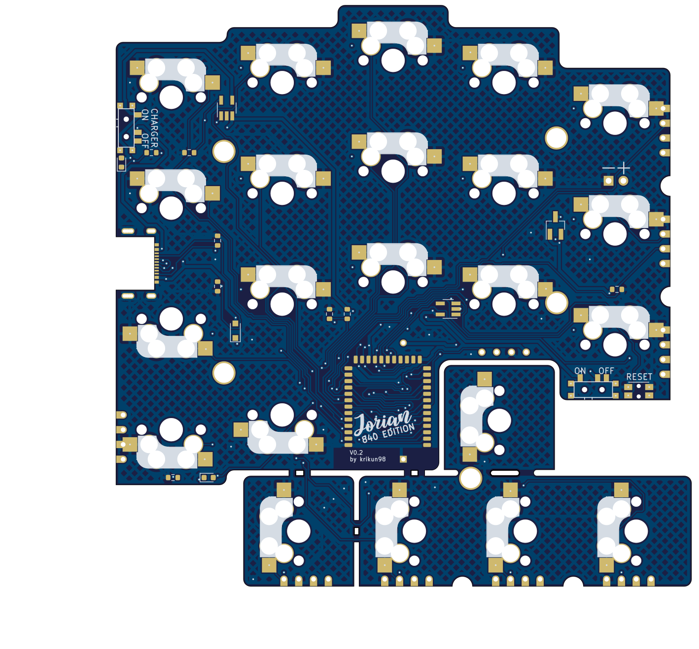
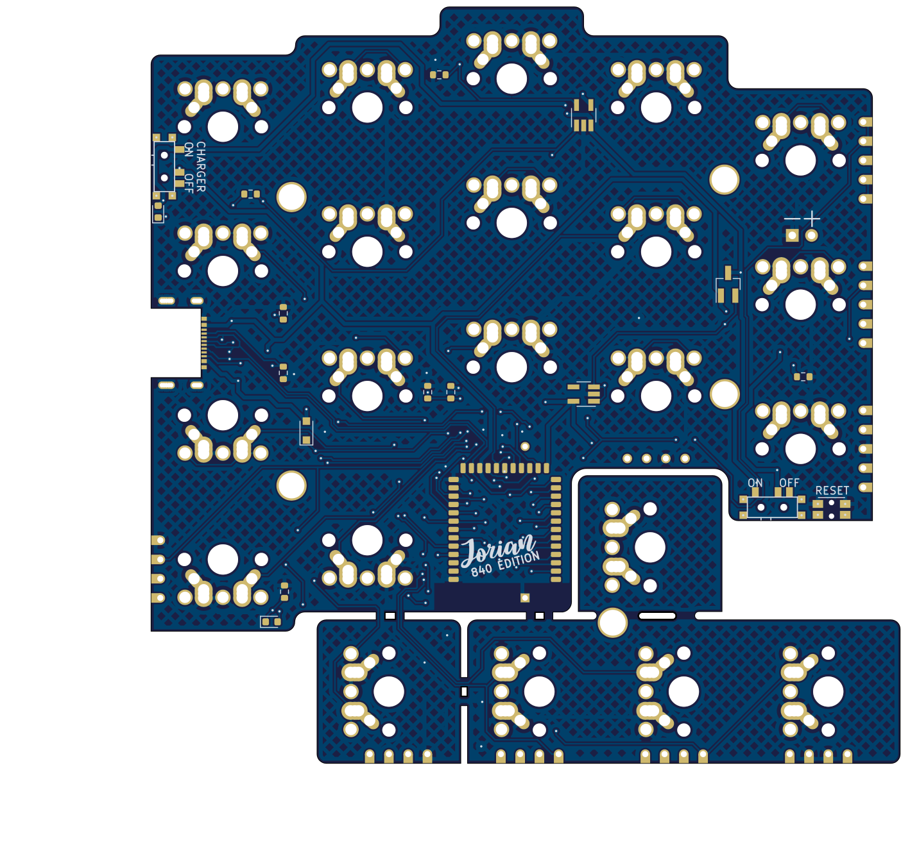

# Jorian 840

44-key wireless split keyboard in a 100x100 mm PCB.

Two main versions are available with plenty of supported switches.

Plates and bottoms are to be cut from metal, acryllic or dual-layered plastic.

## Disclaimer

The keyboard layout is derived from the [Jian layout](http://www.keyboard-layout-editor.com/#/gists/4b6c2af67148f58ddd6c6b2976c4370f) (just visually, there was no actual copying involved).
Please buy the Jian from its author, [/u/KgOfHedgehogs](http://reddit.com/u/KgOfHedgehogs) at [the official store](https://killswit.ch)

## Download

You can download Gerber files and schematic in the [releases section](https://github.com/krikun98/jorian_840/releases).

## Instructions

Please refer to the public [Jorian wiki](https://github.com/krikun98/jorian_840/wiki).

For building the artifacts locally you need Docker. 

Just run the `build.sh` script.

## Pictures

### Version 1.0

MX Hotswap version

Regular version (MX/Alps/Omron B3G-S)

